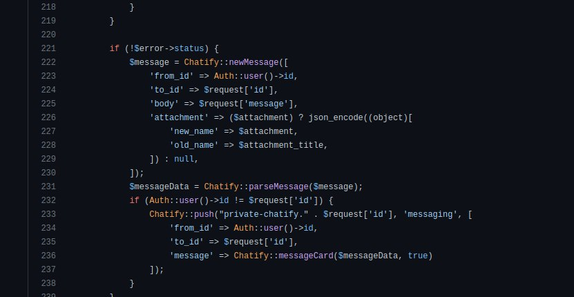
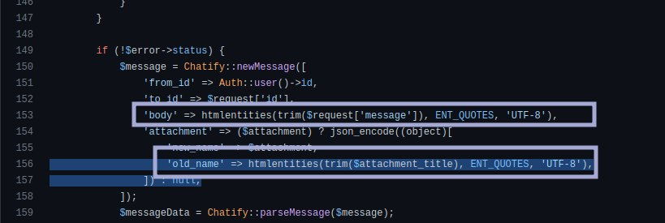

# lab 2

## Requirements

مطلوب مهمة الهدف منها تحقيق ثغرة XSS من خلال عمل تطبيق شات (web code) مع قاعدة بيانات (mysql) بحيث :-

1. يقوم أحد المشاركين في الشات بتحميل كود يستدعي صورة من أي موقع ويخزن هذا الكود في قاعدة البيانات بحيث يتم يتم تحميل الكود عند عمل AutoRefresh للصفحة عند المشاركين في الشات.
2. يقوم أحد المشاركين في الشات بتحميل كود يقرأ الـ local cookies ويخزن هذا الكود في قاعدة البيانات بحيث يتم تحميل الكود عند عمل AutoRefresh للصفحة عند المشاركين في الشات. ويتم ارسال محتوى الـ cookies إى قاعدة بيانات بحيث تصبح البيانات موجودة لدى المخترق.
3. يتم عمل الكود الصحيح لحل المشكلة الموضحة في النقطتين 1،2

مطلوب عمل مجموعات مكونة من طالبين. يتم التسليم في وقت المحاضرة يوم الاثنين القادم 6.3.2023 على اجهزتكم الشخصية.
دمتم موفقين

## Implementation

# \* [chatApp](./chatXSS/)

# \* [XSSCookiesHolder](./XSSCookiesHolder/)

## Online Demo

# \* [chatApp](https://chat.khader.atyaf.cloud/)

# \* [XSSCookiesHolder](https://khader.atyaf.cloud/)

---

---

## Discussion

> Insecure Code:
>
> > 

---

> Secure Code:
>
> > 
